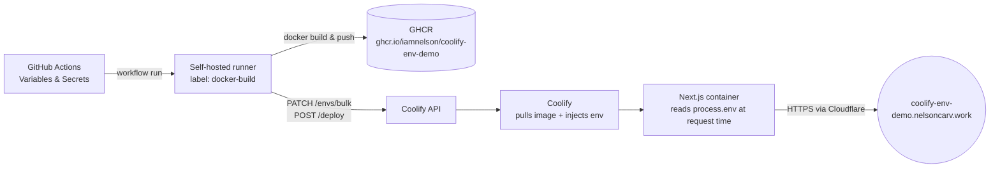

# coolify-env-demo

**A live, working proof that config lives in GitHub — not in the deployment target.**

[](https://github.com/iamnelson/coolify-env-demo/actions/workflows/deploy.yml)


**Live app:** https://coolify-env-demo.nelsoncarv.work

---

## The problem this solves

Every team eventually asks: *"if I change a value in GitHub, does it actually reach production — and can I prove it without SSH-ing into a box?"*

This repo is a minimal, disposable answer. One push updates a GitHub Actions **Variable** and **Secret**, and within a couple of minutes the *exact same values* are readable — server-side only — on a container running behind Coolify, Traefik, and Cloudflare. No dashboards to trust blindly, no "should be updated" — the page renders the live value on every request.

## Architecture



**No shared secret store, no manual dashboard edits.** GitHub Actions is the single source of truth; Coolify is just the runtime.

## What's actually being proven

| Claim | How it's verified |
|---|---|
| Env vars are read server-side, not baked into the client bundle | `app/page.tsx` is a server component with `export const dynamic = "force-dynamic"` — values are resolved per-request, never inlined at build time |
| Secrets stay secret | The page renders a masked preview (`Toda...ay`) of `APP_SECRET_HINT`, never the raw value — same principle you'd want for API keys in a real app |
| GitHub is the deploy trigger, not a human clicking around | `git push` → self-hosted Actions runner (`docker-build` label) → build, push to GHCR, sync vars to Coolify, trigger redeploy — zero manual steps |
| The loop is closed | Change `APP_MESSAGE` in **Settings → Secrets and variables → Actions**, re-run the workflow, refresh the page — new value, new `BUILD_TIME` |

## Stack

- **Next.js (App Router, TypeScript)** — server component, standalone output build
- **Docker** — multi-stage build, non-root runtime user, `~150MB` final image
- **GitHub Actions** — self-hosted runner (`docker-build` label), builds and pushes to GHCR
- **Coolify** — deployment target, Traefik reverse proxy, Cloudflare in front

## Try it yourself

```sh
npm install
npm run dev
```

Copy `.env.example` → `.env.local` first. Healthcheck lives at `/api/health`.

## Prove it end-to-end

1. Go to **Settings → Secrets and variables → Actions** on this repo
2. Edit the `APP_MESSAGE` variable
3. Re-run the [latest workflow run](https://github.com/iamnelson/coolify-env-demo/actions/workflows/deploy.yml) (or push a commit)
4. Refresh https://coolify-env-demo.nelsoncarv.work — new message, new `BUILD_TIME`, same masked secret
