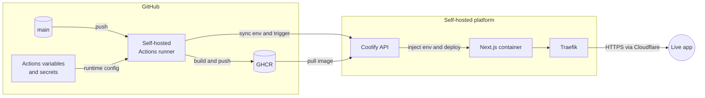

# 🚢 coolify-env-demo

> **Change it in GitHub. Watch it land in production. No SSH. No dashboard drift.**
> A live, working proof that GitHub can own runtime configuration all the way
> from Actions variables and secrets to a container running on Coolify.

[](https://github.com/iamnelson/coolify-env-demo/actions/workflows/deploy.yml)
[](https://github.com/iamnelson/coolify-env-demo/actions/workflows/sast.yml)
[](https://github.com/iamnelson/coolify-env-demo/actions/workflows/dast.yml)
[](https://coolify-env-demo.nelsoncarv.work)


This is a deliberately small application with one serious job: prove, end to
end, that a value changed in GitHub reaches the live server environment and is
read at request time — without a human editing production by hand.

**See the proof running now:** [coolify-env-demo.nelsoncarv.work](https://coolify-env-demo.nelsoncarv.work)

## 🎯 Why this exists

- **Configuration drift is easy to create and hard to see.** A value in GitHub
  and a value in a deployment dashboard can quietly become two different
  truths. Here, GitHub is the source of truth and Coolify is only the runtime.
- **“The deploy succeeded” is not the same as “the value reached the app.”**
  This page reads the current environment on every request, so the final result
  is visible and testable from the browser.
- **Secrets need proof without disclosure.** The application shows only a
  masked preview of the deployed secret, confirming that it arrived while never
  rendering the raw value.
- **Self-hosted delivery should still feel like a platform.** One push builds
  an immutable image, publishes it to GHCR, synchronizes runtime configuration,
  and asks Coolify to redeploy it.

## 💡 The idea

GitHub owns the desired state. A self-hosted Actions runner turns the commit into
an image, sends the environment values to Coolify through its API, and triggers
the deployment. The Next.js server reads those values only when a request
arrives.

- 📝 **Change** `APP_MESSAGE` in GitHub Actions variables.
- 🏗️ **Build** a multi-stage, non-root Next.js container.
- 📦 **Publish** immutable `latest` and commit-SHA tags to GHCR.
- 🔄 **Synchronize** variables and secrets through the Coolify API.
- 🚀 **Redeploy** the application without touching the server.
- 👀 **Verify** the new message and deployment timestamp in the live app.



There is no second configuration source to reconcile. GitHub declares it;
Coolify runs it.

## 🛡️ Security checks

Every commit pushed to GitHub and every pull request update runs two independent
security checks (`.github/workflows/sast.yml` and `.github/workflows/dast.yml`)
before deployment. Both are required, run in parallel, and are independent of
the `Build and deploy` pipeline — a security finding never ships an image.

### SAST — static analysis

- Runs CodeQL's `security-extended` query suite against the JavaScript and
  TypeScript source with the [`github/codeql-action`](https://github.com/github/codeql-action).
- Triggers on every `push`, every `pull_request`, and manually via
  `workflow_dispatch`.
- Findings are published under the repository's **Security → Code scanning
  alerts** tab, not just in the workflow log.
- Needs `security-events: write` permission to upload results; no other
  permissions are granted.

### DAST — dynamic analysis

- Builds the current commit into a throwaway Docker image, starts it on an
  isolated `dast-network` Docker network with placeholder environment values
  (never real secrets), waits for `/api/health` to respond, then points an
  [OWASP ZAP](https://www.zaproxy.org/) baseline scan
  (`ghcr.io/zaproxy/zaproxy:stable`) at it.
- The scan **only ever targets the temporary container**, never
  `coolify-env-demo.nelsoncarv.work`. Nothing in this workflow can reach
  production.
- Pass/fail behaviour per finding is controlled by `.zap/rules.tsv`: each rule
  ID is `FAIL` (blocks the workflow — currently missing/invalid framing,
  content-type, cross-origin-isolation, permissions-policy, missing CSP, and
  CSP-wildcard findings), `IGNORE` (recorded, non-blocking — mostly caching
  and legacy header advisories that don't apply to this app), or `INFO`. Any
  new exception added to that file must include a one-line reason as a
  comment above it.
- The HTML and JSON ZAP reports are uploaded as the `zap-baseline-report`
  workflow artifact on every run, including failed ones, so a failure can be
  triaged without re-running the scan.
- The temporary container and network are always removed in a cleanup step,
  even when the scan fails.

The application also sends CSP, framing, MIME-sniffing, referrer,
cross-origin-isolation, and browser permissions headers
(see `next.config.ts`), which the DAST check validates on every run. If DAST
starts failing after a change, check the response headers first — a real
regression should be fixed there rather than added to `.zap/rules.tsv` as an
`IGNORE`.

### Running the ZAP baseline scan locally

Reproduces exactly what `.github/workflows/dast.yml` runs in CI, so a finding
can be triaged or a fix confirmed before pushing. Requires a running Docker
engine.

```bash
# 1. Build the same image the workflow scans
docker build --tag dast-target:local .

# 2. Start it on an isolated network with placeholder (non-real) values
docker network create dast-network
docker run --detach --rm --name dast-target --network dast-network --network-alias app \
  --env APP_MESSAGE="local DAST" \
  --env APP_SECRET_HINT="local-placeholder" \
  --env BUILD_TIME="local" \
  dast-target:local

# 3. Wait until the health endpoint responds
docker exec dast-target curl --fail --silent http://localhost:3000/api/health

# 4. Run the same ZAP baseline scan and ruleset as CI
mkdir --parents zap-reports
docker run --rm --network dast-network \
  --volume "$PWD:/zap/src:ro" \
  --volume "$PWD/zap-reports:/zap/wrk:rw" \
  ghcr.io/zaproxy/zaproxy:stable \
  zap-baseline.py \
    --autooff \
    -s \
    -c /zap/src/.zap/rules.tsv \
    -t http://app:3000 \
    -m 1 \
    -T 2 \
    -r /zap/wrk/zap-report.html \
    -J /zap/wrk/zap-report.json

# 5. Clean up
docker rm --force dast-target
docker network rm dast-network
```

Open `zap-reports/zap-report.html` for the human-readable report. A non-zero
exit code from `zap-baseline.py` means a rule marked `FAIL` in
`.zap/rules.tsv` was triggered — fix the underlying response (usually a
header in `next.config.ts`) rather than loosening the rule.

## 🧪 What is actually proven

| Claim | Live evidence |
|---|---|
| Environment values are runtime configuration | `app/page.tsx` is a dynamic server component and reads `process.env` on every request |
| The secret reaches the container without being exposed | The UI renders only a masked preview of `APP_SECRET_HINT` |
| Every deployment is identifiable | `BUILD_TIME` is generated during the workflow and displayed by the running application |
| GitHub drives production | The workflow builds, pushes, calls Coolify's environment API, and triggers the redeploy |
| The container is ready for real hosting | It runs as a non-root user and exposes a dedicated `/api/health` endpoint |
| Server-side actions reach the runtime | The **Write server log** button emits a timestamped entry in the application logs |

## 🚀 Prove it end to end

1. Open the repository's **Settings → Secrets and variables → Actions**.
2. Change the `APP_MESSAGE` variable.
3. Re-run [Build and deploy](https://github.com/iamnelson/coolify-env-demo/actions/workflows/deploy.yml), or push a commit to `main`.
4. Open the [live application](https://coolify-env-demo.nelsoncarv.work).
5. Confirm the new message, the new deployment timestamp, and the masked secret.

That closes the loop from declared configuration to observable production
state.

## 💻 Run it locally

```bash
git clone https://github.com/iamnelson/coolify-env-demo.git
cd coolify-env-demo
cp .env.example .env.local
npm install
npm run dev
```

Open [localhost:3000](http://localhost:3000). The health endpoint is available
at [localhost:3000/api/health](http://localhost:3000/api/health).

## 🔐 Deployment contract

The workflow expects these repository values:

| Name | Type | Purpose |
|---|---|---|
| `GHCR_IMAGE` | Variable | Full GHCR image name |
| `COOLIFY_URL` | Variable | Base URL of the Coolify instance |
| `COOLIFY_APP_UUID` | Variable | Target application identifier |
| `APP_MESSAGE` | Variable | Public demo message shown by the app |
| `COOLIFY_API_TOKEN` | Secret | Authenticates calls to the Coolify API |
| `APP_SECRET_HINT` | Secret | Demonstrates masked runtime secret delivery |

`BUILD_TIME` is created automatically during the workflow. The deployment
publishes both `latest` and the full commit SHA, keeping the running artifact
traceable to Git.

## 🗂️ What is here

- 🌐 `app/` — the dynamic Next.js page, server action, and health endpoint.
- 🐳 `Dockerfile` — a multi-stage standalone build with a non-root runtime.
- ⚙️ `.github/workflows/deploy.yml` — build, GHCR publish, environment sync,
  and Coolify redeploy in one pipeline.
- 🛡️ `.github/workflows/sast.yml` and `.github/workflows/dast.yml` — CodeQL
  static analysis and isolated OWASP ZAP dynamic scanning for each change.
- 🧾 `.zap/rules.tsv` — the DAST failure policy and documented exceptions.
- 🧰 `.env.example` — the complete local configuration contract, with no real
  credentials.

## 🧯 What broke along the way

This is a small demo, but it records real platform failures rather than hiding
them:

- A GHCR organization policy blocked the first public package path.
- A missing `curl` binary caused Coolify's container healthcheck to fail.
- The fixes live in the commit history, alongside the working deployment.

That history is part of the proof: the project was operated, debugged, and
recovered — not only diagrammed.

## ✨ Built with

- **[Claude Code](https://claude.com/claude-code)** — deployment orchestration,
  Coolify API wiring, and production debugging.
- **Codex** — initial Next.js, Docker, and repository scaffolding.
- **[Coolify](https://coolify.io)** — the self-hosted platform under test.

## 📖 References

- [Next.js: deploying with Docker](https://nextjs.org/docs/app/getting-started/deploying#docker)
- [Next.js: environment variables](https://nextjs.org/docs/app/guides/environment-variables)
- [Docker multi-stage builds](https://docs.docker.com/build/building/multi-stage/)
- [GitHub Actions variables](https://docs.github.com/en/actions/learn-github-actions/variables)
- [GitHub Actions secrets](https://docs.github.com/en/actions/security-guides/encrypted-secrets)
- [GitHub-hosted and self-hosted runners](https://docs.github.com/en/actions/hosting-your-own-runners)
- [GitHub Container Registry](https://docs.github.com/en/packages/working-with-a-github-packages-registry/working-with-the-container-registry)
- [Coolify documentation](https://coolify.io/docs)
- [Cloudflare DNS documentation](https://developers.cloudflare.com/dns/)
